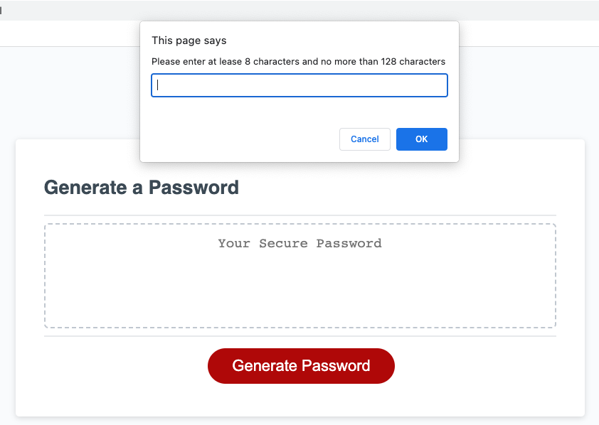

# password-generator

## Description
I use the Javascript to create a webpage for user to generate random password.

## Tech used
- JavaScript
- GitHub
- Terminal
- Visual Studio Code

## Use
- Step 1: user input the length of password they want.
- Step 2: user input the type of password they want.
- Step 3: system will generate the password upon user's request.

## Learning point
- I learn how to generate random number. 
- I learn how to store lowercase/uppercase/numeric/special password inside the string. 

## Link
https://yingyliu.github.io/password-generator/

## License
Please refer to the LICENSE in the repo.